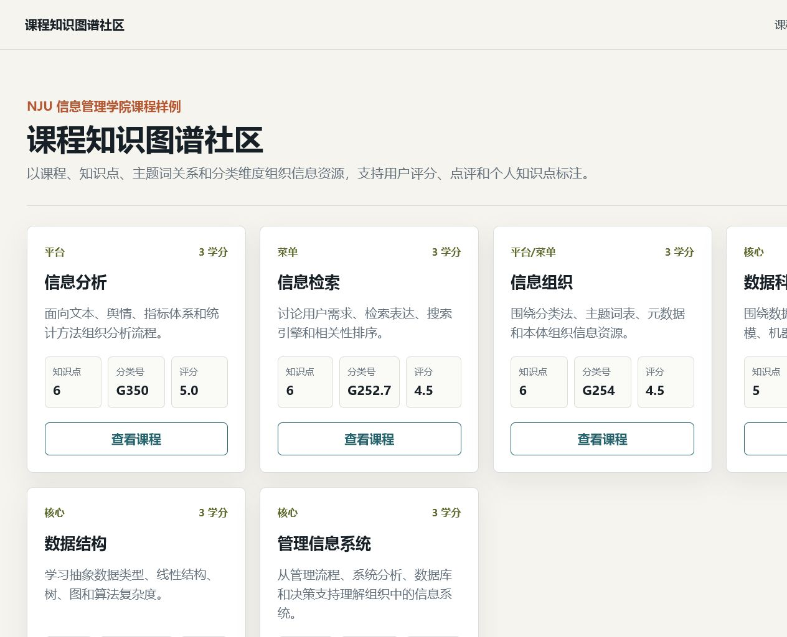
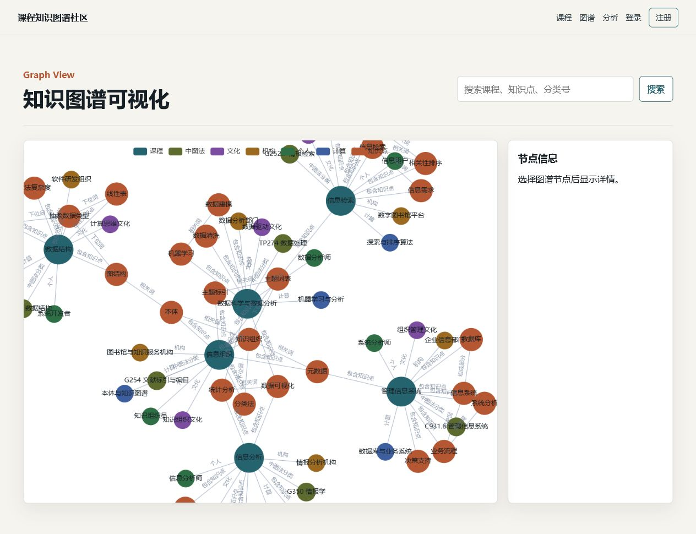
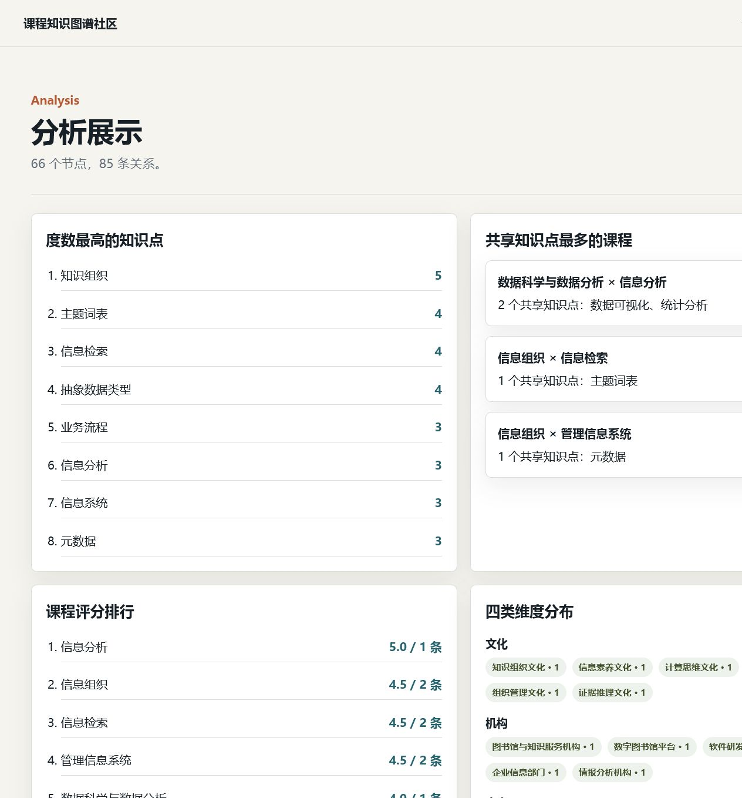

# 信息组织大作业：课程知识图谱社区系统

本项目实现课程知识图谱社区系统，覆盖课程列表、用户注册登录、课程评分点评、知识点个人标注、知识图谱可视化和基础分析展示。作业要求来自 `信息组织大作业2026.docx`，截止日期为 2026-07-30。

## 功能清单

- 多用户注册、登录、注销。
- 主页展示 6 门信息管理学院课程及评分概览。
- 课程详情页展示课程元数据、中图法分类号、四类维度、知识点、用户点评和知识点标注。
- 登录用户可提交课程评分/点评，可对知识点添加公开或私有标注。
- 知识图谱页使用 ECharts 力导向图展示课程、知识点、中图法分类、文化/机构/个人/计算维度。
- 分析页展示度数最高知识点、共享知识点最多课程、评分排行和四类维度分布。

## 项目结构

```text
mysql/
  schema.sql              MySQL 建表与 3 个虚拟用户样例动态数据
neo4j/
  init.cypher             Neo4j 课程知识图谱初始化脚本
backend/
  app.py                  Flask 路由与 CLI
  models.py               用户、点评、标注关系模型
  graph_repository.py     Neo4j 访问层和本地样例图谱 fallback
  data/sample_graph.json  本地演示图谱数据
frontend/
  templates/              Jinja2 多页面模板
  static/                 CSS 与图谱 JS
ontology/
  course_ontology.owl     OWL 本体文件
docs/
  data_design.md          本体与数据分工说明
报告.docx                 系统功能与信息组织理论说明
```

## 数据库设计

Neo4j 存储稳定图谱结构：

- `Course`：课程节点。
- `KnowledgePoint`：知识点节点。
- `CLCClass`：中图法分类节点。
- `DimensionValue`：文化、机构、个人、计算四类维度取值。
- 关系包括 `HAS_KNOWLEDGE_POINT`、`CLASSIFIED_BY`、`HAS_DIMENSION`、`KNOWLEDGE_RELATION`。

MySQL 存储运行时动态数据：

- `users`：用户账号。
- `course_reviews`：课程评分点评。
- `knowledge_annotations`：知识点个人标注。

## 快速本地预览

没有 MySQL/Neo4j 时可先用 SQLite 和本地样例图谱预览页面：

```powershell
python -m venv .venv
.\.venv\Scripts\Activate.ps1
pip install -r requirements.txt
$env:FLASK_APP = "backend.app"
flask init-db
flask seed-demo
flask run
```

访问 `http://127.0.0.1:5000`。演示用户：`sim_user_a`，密码：`password123`。

## MySQL + Neo4j 完整运行

1. 复制环境变量：

```powershell
Copy-Item .env.example .env
```

2. 启动数据库：

```powershell
docker compose up -d
```

3. 导入 Neo4j 图谱：

```powershell
Get-Content .\neo4j\init.cypher | docker exec -i coursekg-neo4j cypher-shell -u neo4j -p coursekg2026
```

4. 安装依赖并启动 Flask：

```powershell
python -m venv .venv
.\.venv\Scripts\Activate.ps1
pip install -r requirements.txt
$env:FLASK_APP = "backend.app"
flask run
```

MySQL 会通过 `mysql/schema.sql` 自动创建表和样例动态数据。若本机 3306 或 7687 端口已被占用，请调整 `docker-compose.yml` 和 `.env`。

## 数据来源与整理说明

- 课程名称与部分课程号/学分参考南京大学本科生院公开的 [2021 版本科人才培养方案和教育教学计划](https://jw.nju.edu.cn/d7/86/c34861a579462/page.htm)。
- 课程样例参考南京大学信息管理学院公开课表 PDF：[信息管理与信息系统授课计划及课程表（2023 级等）](https://im.nju.edu.cn/__local/2/16/2B/80322B97FAEC9EEAFBA1141D783_592491EF_D7E5D.pdf?e=.pdf)。
- 专业背景参考南京大学信息管理学院 [信息管理与信息系统专业介绍](https://im.nju.edu.cn/info/1035/4431.htm)。
- 知识点按作业要求使用《汉语主题词表》的主题词粒度进行整理；中图法分类号为课程作业中的参考性标注。

## 页面截图

主页：



知识图谱页：



分析页：



## 交付物对照

- MySQL 建表及初始动态数据：`mysql/schema.sql`
- Neo4j 初始化脚本：`neo4j/init.cypher`
- Flask 后端：`backend/`
- 前端模板与静态资源：`frontend/`
- 本体文件与说明：`ontology/course_ontology.owl`、`docs/data_design.md`
- 运行说明与数据来源：`README.md`
- 系统报告：`报告.docx`
